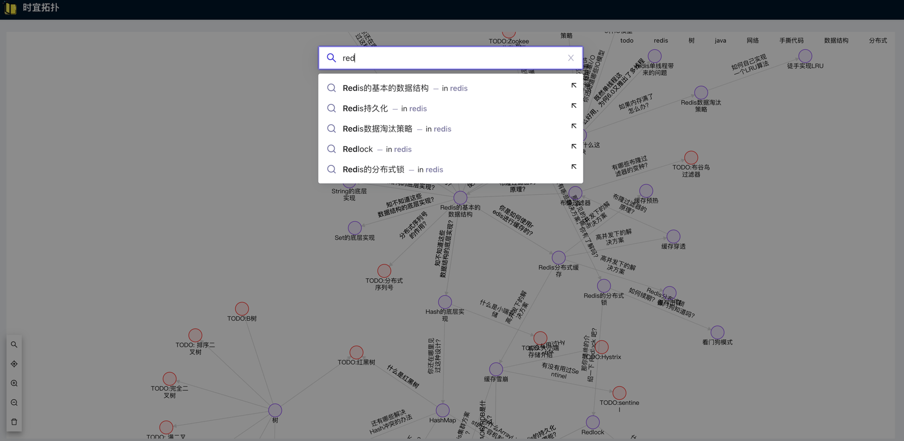
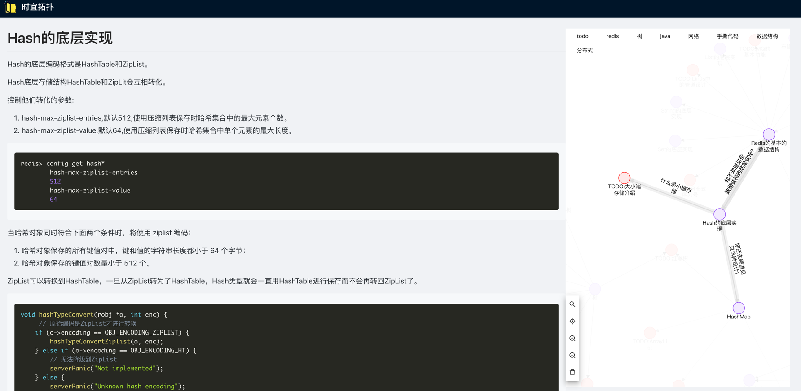

# 时宜拓扑

万事万物皆有关系，包括面试题

每个回答都能向下深挖，挖到你的知识盲区

市面上的面试题都是已平铺的结构展开，与实际的面试有所差距

这个项目主要帮助你，以层层深挖的方式，寻找你的知识盲区

## 如何启动

会直接使用打包好的镜像进行启动

~~~
./quick_start.sh
~~~

如果想编译启动，请在jdk15的环境下使用

```shell
./build_start.sh
```


