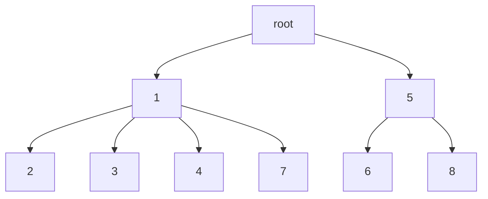

# 树

[involution:  -> 二叉树|自平衡二叉树|B树|字典树]

树是一种数据结构，由n(>=0)个有限`节点Node`组成的一个具有层次关系的集合。

### 树的特点

1. 每个子节点都只有有限个子节点或无子节点。
2. 没有父节点的节点称为`根节点(root)`。
3. 每一个非根节点`有且仅有一个父节点`。
4. 除了根节点每个子节点可以分为多个`不相交的子树`。
5. 树里面没有环路。

### 术语

1. 结点：包含一个数据元素及若干指向子树分支的信息

2. 结点的度：一个结点拥有子树的数目称为结点的度

3. 叶子结点：也称为终端结点，没有子树的结点或者度为零的结点

4. 分支结点：也称为非终端结点，度不为零的结点称为非终端结点

5. 树的度：树中所有结点的度的最大值

6. 结点的层次：从根结点开始，假设根结点为第1层，根结点的子节点为第2层，依此类推，如果某一个结点位于第L层，则其子节点位于第L+1层

7. 树的深度：也称为树的高度，树中所有结点的层次最大值称为树的深度

8. 有序树：如果树中各棵子树的次序是有先后次序，则称该树为有序树

9. 无序树：如果树中各棵子树的次序没有先后次序，则称该树为无序树

10. 森林：由m（m≥0）棵互不相交的树构成一片森林。如果把一棵非空的树的根结点删除，则该树就变成了一片森林，森林中的树由原来根结点的各棵子树构成  。

**用代码来表示**

```java
public class Tree<T> {
    private T val;
   	private List<Tree<T>> children;
}
```


​																																																																																																																																																																																																																																																																																																																																																																																																																																																																																																																																																																																																																																																																																																																																																																																																																																																																																																																																																																																																																																																																																																																																																																																																																																																																																																					




